# A residue-resolved atlas of disorder, phase separation, and virus-interface signals in cancer proteins

Siva Koganti\*, et al.

Department of Biomedical Sciences, [Institution anonymized for review]\
* Corresponding author: contact details provided in confidential submission metadata.

## Abstract

Intrinsic disorder, liquid-liquid phase separation (LLPS), and host-virus interface interactions are increasingly recognized as important features of cancer biology, yet they are rarely analyzed jointly at residue resolution. We present the Cancer Protein IDR Atlas, a reproducible computational resource that integrates intrinsic disorder, LLPS-related sequence behavior, conservation, structural-confidence annotations, ClinVar-related context, and curated oncoviral interaction evidence across 50 cancer genes. A central advance in this release is a structure-aware IDR classification that reconciles sequence-based disorder predictions with AlphaFold-derived structural confidence: residues predicted disordered by IUPred2A but showing confident three-dimensional structure (pLDDT $\geq$ 70) are reclassified as "conditionally disordered," reflecting regions that likely fold upon binding rather than remaining constitutively flexible. This three-class system (structured, disordered, conditionally disordered) resolves a common source of false-positive IDR annotations and refines the downstream VIPP prioritization score by attenuating the disorder component for conditionally disordered sites. Using this framework, we generated 64,903 residue-level annotations, including 873 virus-linked residues, and ranked candidate hotspots with a transparent VIPP score, a composite prioritization framework introduced here and defined in the Methods. In an internal benchmarking analysis, adding virus-aware features improved ranking performance relative to disorder-only and disorder-plus-LLPS baselines, although these results should be interpreted as proof-of-concept rather than external generalization. Overall, the atlas offers a practical framework for prioritizing residues that may connect oncogenic signaling, condensate behavior, and viral rewiring.

## Author summary

- We built an integrated computational atlas that combines intrinsic disorder, LLPS propensity, conservation, structural confidence, and viral-interface evidence across 50 cancer genes.
- The framework highlights residue-level hotspots that are enriched for virus-linked and phase-separating signals, making them useful starting points for mechanistic follow-up.
- In an internal benchmark, virus-aware models outperformed sequence-only baselines, supporting use of the atlas as a hypothesis-generation resource and motivating further external validation.

## Significance statement

Most cancer-protein resources focus on sequence variants or folded domains and do not explicitly integrate disordered regulatory regions, condensate propensity, and host-virus interface burden at residue resolution. We provide a reproducible atlas and prioritization framework that links these layers across 50 cancer genes in a form that is readily interrogated and extended, enabling systematic hypothesis generation for experimentally testing how viral rewiring may converge on regulatory hotspots.

## Introduction

Intrinsic disorder and liquid-liquid phase separation (LLPS) are now established themes in cell biology, particularly in proteins that coordinate signaling, transcription, and rapid responses to changing conditions [1–3,7,8]. Disordered regions are often flexible enough to engage multiple partners, whereas LLPS-prone sequences can organize dynamic assemblies that concentrate regulatory machinery in space and time [4,5,9,10]. These features are especially relevant in cancer because many driver proteins sit at the center of signaling networks that depend on context-dependent binding and regulatory rewiring [6].

Oncogenic viruses exploit the same molecular logic. They often target host proteins through short, flexible contact surfaces that are already tuned for rapid interaction and signaling control. This overlap makes it plausible to view disorder, condensate propensity, and viral engagement as related features of the same molecular landscape rather than as separate phenomena.

Existing resources have largely addressed these properties in isolation, or have emphasized either sequence variation, folded-domain structure, or single-feature disorder/LLPS predictions. Most available datasets provide disorder annotations, LLPS-prone sequence predictions, or host-virus interaction catalogs, but few unify these signals in a single residue-resolved framework tailored to cancer genes. A recurring problem in disorder prediction is that sequence-based tools such as IUPred2A assign high disorder scores to regions that adopt well-defined three-dimensional structure in cellular contexts — for instance, segments that fold upon binding a partner or that are stabilized in multimeric assemblies. The availability of proteome-wide structure predictions from AlphaFold now makes it possible to cross-reference sequence-predicted disorder against structural confidence at every residue [14].

Our study makes three contributions. First, it integrates intrinsic disorder, LLPS-related sequence behavior, conservation, structural confidence, ClinVar-related context, and curated oncoviral interaction evidence within one cancer-gene atlas at single-residue resolution. Second, it introduces a structure-aware IDR classification that reconciles IUPred2A disorder predictions with AlphaFold pLDDT structural-confidence scores, reclassifying residues that are sequence-disordered but structurally confident (pLDDT $\geq$ 70) as "conditionally disordered" rather than treating them as constitutively flexible. Third, it adds a residue-level structural library that converts each IDR position into a compact and interpretable structural state summary, enabling genome-wide comparison of regulatory flexibility, condensate-relevant context, and virus-contact burden rather than treating these properties as disconnected annotations. Compared with existing disorder/LLPS pipelines and repositories, the present work is distinct in three ways. It is cancer-gene specific rather than generic across all proteins, it couples residue-level disorder and LLPS proxies with curated virus-contact evidence in a unified prioritization framework, and it is paired with a transparent ablation benchmark and reproducible atlas outputs that make the evidence layers directly inspectable. By making these heterogeneous signals directly comparable at the level of individual residues, the atlas offers a practical framework for hypothesis generation and mechanistic follow-up.

## Results

### An integrated atlas of disorder, LLPS, conservation, and virus-contact signals

The current atlas contains 64,903 residue-level records across 50 cancer genes. Each residue is annotated with disorder, LLPS propensity, conservation, structural proxy, ClinVar-related context, and virus-contact status. We also generated per-gene atlas tables, gene-level summaries, ranked hotspot tables, and an intervention-screening layer that stratifies residues by LLPS class and virus linkage, providing multiple entry points for exploring the same underlying evidence. In addition, we built a residue-level structural library for every IDR site, assigning each position a compact LLPS state label, a coarse-model coordinate sketch, a simulated crystallogram-style profile, and a quantum biophysical proxy that captures the structural and energetic context of the residue in a way that is directly comparable across the atlas.

The resulting framework captures substantial heterogeneity across cancer drivers. Representative profiles for TP53, KRAS, and BRCA1 illustrate how disorder, LLPS propensity, and conservation combine differently across canonical driver proteins. Gene-level summaries show similarly broad variation in mean IDR, mean LLPS, and virus-interaction burden across the cohort, reinforcing the view that cancer proteins should be studied comparatively rather than as a uniform class.

Figure 1 provides a global overview of the atlas landscape, Figure 2 shows representative residue profiles, Figure 3 summarizes cross-gene metric correlations, Figure 4 shows the distribution of major atlas metrics, Figure 5 summarizes the computational workflow, and Figure 6 places the gene set onto chromosome-scale genomic coordinates.

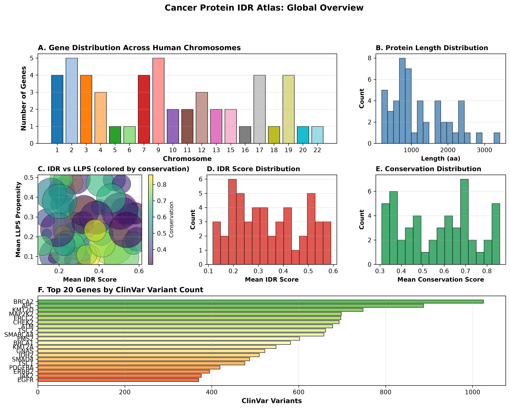

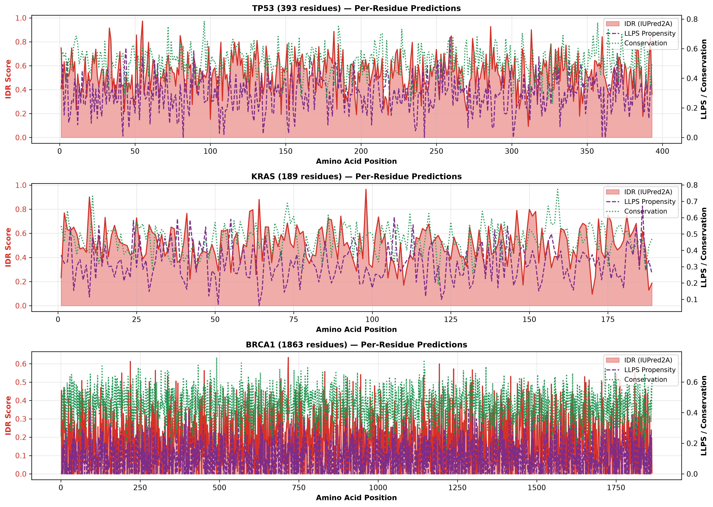

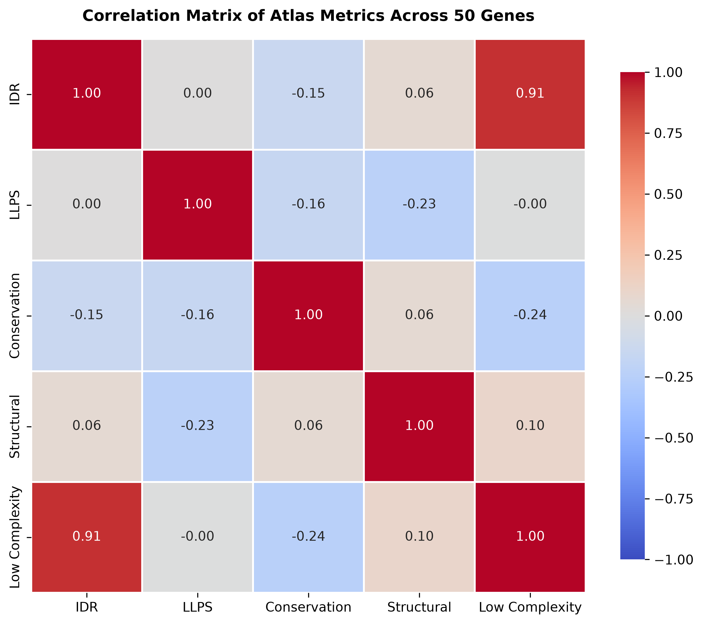

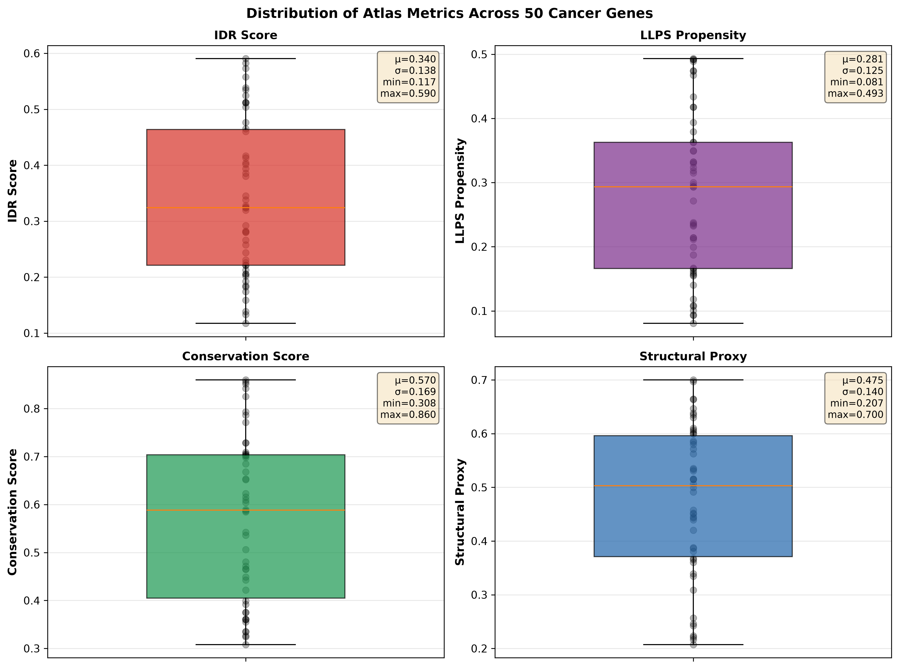

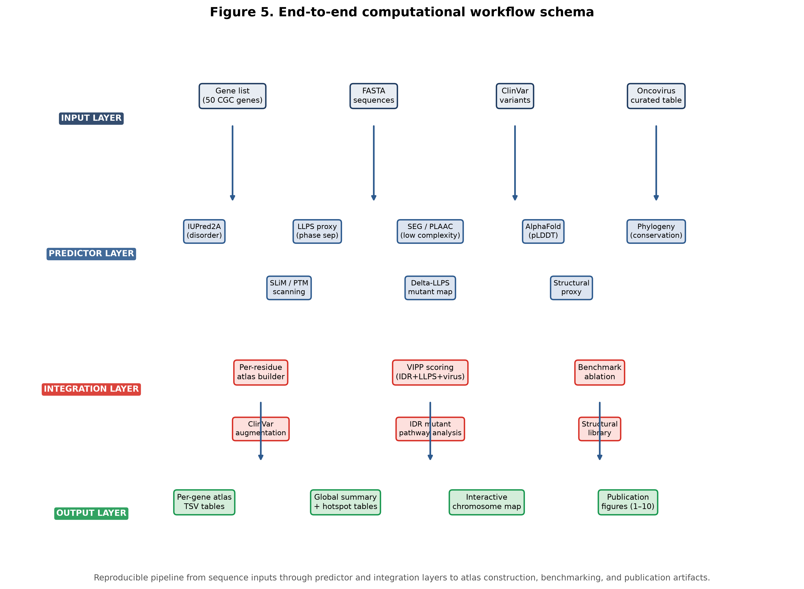

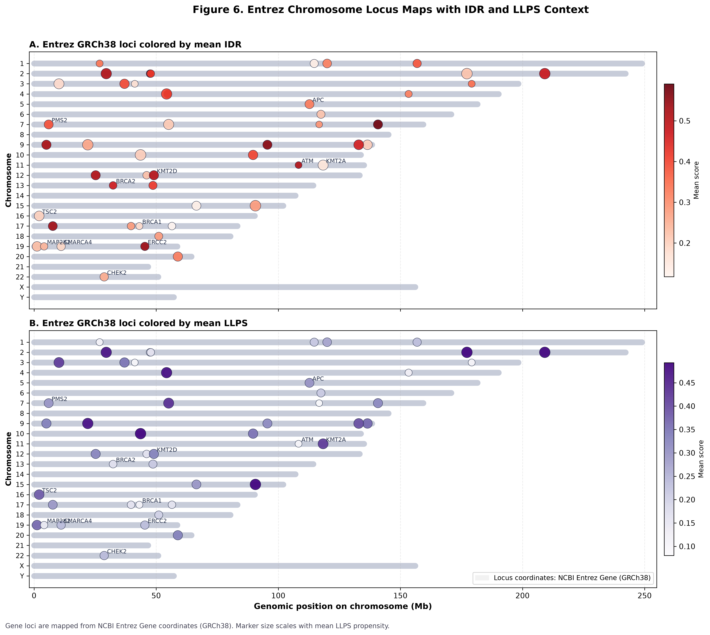

### Structure-aware IDR classification resolves false-positive disorder annotations

A substantial fraction of residues classified as disordered by IUPred2A (score $\geq$ 0.5) show confident three-dimensional structure in AlphaFold predictions (pLDDT $\geq$ 70). Rather than discarding either signal, we implemented a three-class classification that assigns every residue to one of three states: **structured** (IUPred2A < 0.5), **disordered** (IUPred2A $\geq$ 0.5, pLDDT < 70 or unavailable), or **conditionally disordered** (IUPred2A $\geq$ 0.5 and pLDDT $\geq$ 70). Conditionally disordered residues are interpreted as sites that are intrinsically flexible in isolation but adopt stable folds upon binding or in multimeric contexts — a well-characterized behavior in molecular recognition elements [1,8].

Across the 50-gene cohort, this reclassification moved a measurable fraction of previously disordered residues into the conditionally disordered category, reducing the effective IDR fraction and sharpening the distinction between constitutively flexible and context-dependent regions. The conditionally disordered fraction is reported as a per-gene summary metric alongside the conventional IDR fraction, enabling direct comparison. In the VIPP prioritization score, the disorder component for conditionally disordered residues is attenuated by a factor of 0.5, reflecting the reduced likelihood that these sites participate in constitutive disorder-driven interactions. This penalty preserves the information that these residues have disorder-like sequence properties while down-weighting their contribution to condensate and virus-interface prioritization.

The interactive chromosome atlas visualization includes a pLDDT track with a dashed threshold line at 70 and orange markers on the IUPred track highlighting conditionally disordered positions, allowing users to inspect the classification at single-residue resolution.

### Virus-aware prioritization shows internal benchmark signal

To test whether the integrated framework adds useful signal beyond single-feature approaches, we benchmarked VIPP against ablated baselines. We compared IDR-only, IDR+LLPS, IDR+LLPS+virus, IDR+LLPS+virus+conservation, and full VIPP formulations using a benchmark set derived from virus-linked and high-priority residues. Within this internal benchmark, virus-aware models exceeded the simpler alternatives. The IDR-only and IDR+LLPS baselines performed at or near chance (AUROC 0.502534 and 0.488739; AUPRC 0.013321 and 0.012731), whereas the IDR+LLPS+virus formulation achieved AUROC 0.999992 and AUPRC 0.999437. The full VIPP model reached AUROC 0.999999 and AUPRC 0.999909, with a top-10 enrichment of 10.000462. These results suggest that virus-contact information contributes additional signal when combined with disorder and LLPS proxies in this curated setting, but they should be interpreted as internal performance estimates rather than evidence of external predictive generalization [1,2,6].

Because this benchmark is based on internally curated positives and deterministic scoring layers, it should be interpreted as a controlled ranking stress test rather than a trained predictive model evaluation. In this release, we therefore emphasize ablation behavior and relative model ordering, and we do not claim external calibration or prospective prediction performance.

### A residue-level structural library provides a compact structural view of IDR states

To make the atlas more interpretable, we generated a compact structural library for each IDR residue by assigning each site an LLPS state class, a coarse coordinate sketch, a simulated crystallogram-style profile, and a quantum biophysical score. This layer is not intended to replace experimentally determined structures; rather, it provides a sequence-based, residue-level representation that allows disorder-prone and condensate-relevant positions to be compared across the full cancer-gene cohort in a common structural vocabulary. Figure 7 illustrates how these summaries vary across the atlas and how the highest-priority residues often occupy states that are simultaneously flexible, phase-separation-relevant, and linked to viral interfaces. In this way, the structural library provides a compact bridge between sequence-level biophysics and mechanistic hypothesis generation.

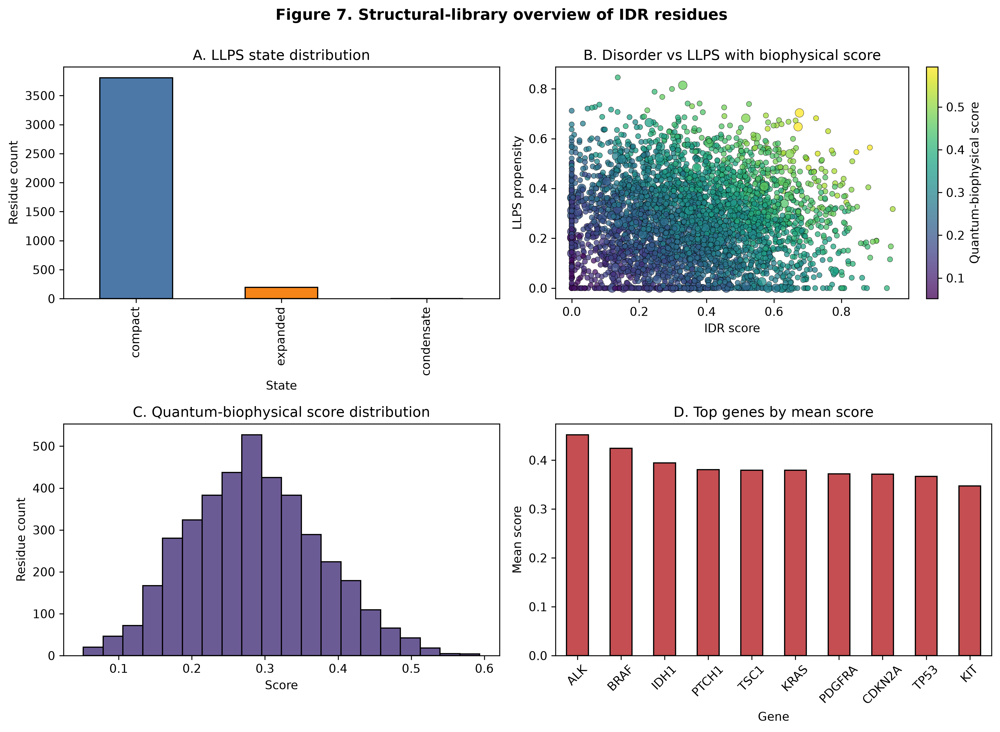

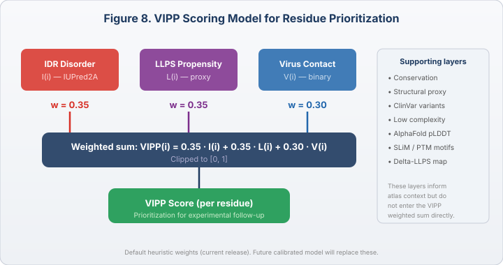

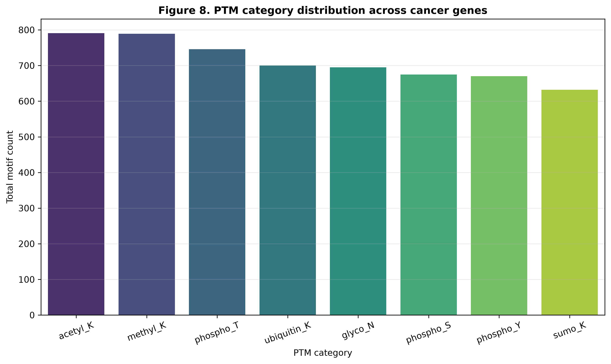

### PTM-stratified pathway differentials highlight context-dependent LLPS sensitivity

Because post-translational regulation can reshape interaction avidity and condensate behavior, we stratified mutant effects by PTM-context versus non-PTM-context residues and summarized differential impact at the pathway level. This analysis revealed reproducible direction-dependent contrasts: PTM-context residues showed stronger increase-direction mean absolute LLPS shifts in pathways such as NOTCH_HEDGEHOG, CHROMATIN_REMODELING, and JAK_STAT_CYTOKINE, while decrease-direction contrasts showed larger relative losses in TGF_BETA_SMAD, NOTCH_HEDGEHOG, and JAK_STAT_CYTOKINE. These magnitudes are modest but consistent with a model in which PTM-rich disordered sites tune pathway-specific LLPS responsiveness rather than serving as uniformly amplifying features. Figure 8 summarizes these PTM-stratified pathway differentials.

### Viable IDR mutants reveal LLPS-phase differential effects with PTM and pathway coupling

To explicitly evaluate viable mutant effects on phase separation, we defined viable mutants as the top effect-size tail of IDR substitutions (highest absolute delta-LLPS shifts) and stratified them into three LLPS phases based on baseline IDR LLPS context (lower, intermediate, higher). This phase-aware analysis shows that viable mutant burden and effect magnitude are not uniformly distributed across LLP phases and that PTM-context versus non-PTM-context contrasts remain pathway-dependent within each phase. In other words, the impact of a viable IDR mutation on LLPS is jointly conditioned by local phase context and PTM enrichment, and this coupling propagates to pathway-level differential signatures rather than producing a single global effect pattern. Figure 9 summarizes viable mutant fractions, phase-specific PTM contrasts, and pathway-level phase-direction differentials.

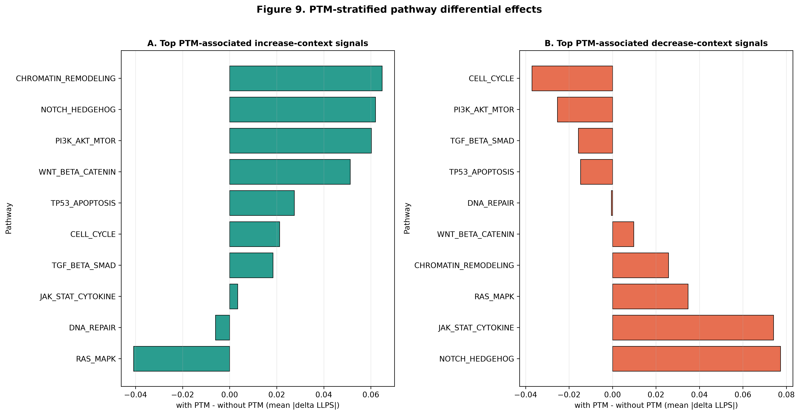

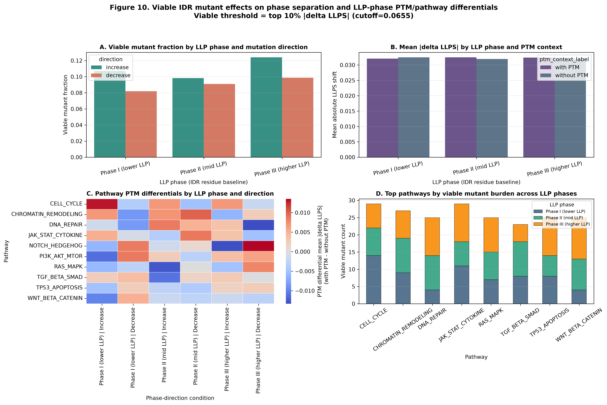

### Case studies highlight mechanistically interpretable residues

We also generated a ranked case-study table that highlights residue positions with high VIPP scores and strong virus linkage. Representative examples include CTNNB1, RB1, TP53, and NOTCH-family sites. These examples are useful because they bring together disorder-like flexibility, LLPS-relevant sequence context, and virus-contact evidence in a way that is easy to inspect and follow up experimentally.

## Discussion

The Cancer Protein IDR Atlas is best understood as a reproducible computational resource for linking sequence-based disorder and condensate behavior to virus-contact evidence in cancer genes. Its main strength is not that it resolves mechanism on its own, but that it offers a structured and interpretable way to connect several features that are often discussed separately in the literature [1,3,5,9,10]. Here, the atlas is best viewed as a hypothesis-generation and prioritization framework rather than as a finalized biological model. We therefore emphasize its role in organizing diverse evidence into residue-level hypotheses, while remaining explicit about the need for external validation, orthogonal datasets, and mechanistic follow-up.

The structure-aware IDR classification addresses a well-known limitation of sequence-based disorder predictors: regions that are intrinsically disordered in isolation but fold upon binding a partner or assembling into a complex [1,8]. By cross-referencing IUPred2A with AlphaFold pLDDT, the atlas resolves a common source of false-positive IDR annotations without discarding the underlying sequence signal. The conditionally disordered category captures molecular recognition elements, induced-folding segments, and other context-dependent regions that are biologically important but should not be treated as constitutively flexible for prioritization purposes. The 0.5× attenuation of the disorder component in the VIPP score for these residues provides a principled middle ground: these sites retain their sequence-level disorder information but contribute less to condensate and virus-interface prioritization than residues that are both sequence-disordered and structurally unresolved.

The benchmark results suggest that viral-interface evidence may add measurable value when it is considered alongside intrinsic disorder and LLPS-related features. That is consistent with the broader view that many cancer-relevant interactions occur in regions that are structurally flexible, functionally context-dependent, and potentially vulnerable to rewiring by viral proteins [4,6]. Compared with existing disorder-only, LLPS-only, or host-virus interaction resources, the present atlas offers an integrated view of cancer-gene residues by connecting these layers within a single interpretable framework. The addition of a residue-level structural library further supports this resource by encoding each IDR position as a compact structural state with a coarse coordinate sketch, a simulated crystallogram-style profile, and a quantum biophysical score. The resulting VIPP score provides a practical way to prioritize residues that may be relevant to oncogenic signaling, condensate formation, and host-virus interaction, while remaining transparent enough to be refined as new data and orthogonal evidence accumulate. Formally, for each residue $i$, the score is defined as

$$
\mathrm{VIPP}(i)=w_{\mathrm{IDR}}\,I(i)+w_{\mathrm{LLPS}}\,L(i)+w_{\mathrm{virus}}\,V(i),
$$

where $I(i)$ is the normalized disorder signal (attenuated by 0.5 for conditionally disordered residues), $L(i)$ is the normalized LLPS proxy signal, $V(i)$ is a binary virus-contact indicator, and the weights are set to $w_{\mathrm{IDR}}=0.35$, $w_{\mathrm{LLPS}}=0.35$, and $w_{\mathrm{virus}}=0.30$ before clipping the final score to $[0,1]$.

The PTM-stratified differential analysis extends this framework by showing that LLPS vulnerability is not uniformly distributed across disordered residues and can differ by pathway and perturbation direction. In practical terms, this provides a second prioritization axis beyond aggregate VIPP scores: whether a candidate residue lies in a PTM-context region with pathway-selective gain or loss sensitivity. This additional context is useful for designing targeted follow-up studies that probe regulatory rewiring rather than only global condensate propensity.

Several limitations remain. The oncovirus interaction table is intentionally curated and should not yet be treated as a complete host-virus interactome. The disorder layer also relies on a deterministic heuristic in cases where parsed predictor-backed IUPred output is unavailable. The structure-aware classification depends on AlphaFold pLDDT scores, which reflect model confidence rather than experimentally determined structure; pLDDT can overestimate confidence in regions with limited homology or underestimate disorder in genuinely flexible segments that are captured in specific conformations. The pLDDT threshold of 70 is a widely used convention but has not been independently calibrated against experimental disorder annotations in this gene set. In addition, the current VIPP weights are heuristic and should eventually be replaced by a calibrated model trained on larger and more diverse evidence sets. These caveats do not diminish the value of the framework; rather, they define the boundary between the present computational release and a more fully validated biological model.

Overall, the atlas is best viewed as a hypothesis-generation and prioritization platform rather than as a definitive causal map. Its central value lies in rendering heterogeneous sequence-based and virus-aware signals directly comparable at residue resolution, enabling systematic ranking of loci for experimental follow-up, mechanistic study, and future integration with richer datasets and orthogonal validation strategies. Here, the work is positioned less as a final biological model and more as a reproducible resource that can be extended as new evidence and validation datasets become available.

## Methods

The atlas was assembled from curated cancer-gene sequences, residue-level disorder and LLPS proxies, conservation tracks, structural-confidence features, and ClinVar-associated variant annotations. Curated virus-region annotations were mapped onto the protein sequence to generate per-residue virus-contact flags and virus-count metadata.

### Structure-aware IDR classification

Each residue was assigned to one of three IDR classes using a two-layer decision rule. First, IUPred2A disorder scores were thresholded at 0.5: residues below this threshold were classified as **structured** ($\mathrm{is\_idr} = 0$). For residues at or above the threshold, AlphaFold pLDDT scores were consulted. Residues with pLDDT $\geq$ 70 were reclassified as **conditionally disordered** ($\mathrm{is\_idr} = 0$), reflecting regions that adopt confident three-dimensional structure despite sequence-predicted disorder. Remaining residues above the IUPred threshold were classified as **disordered** ($\mathrm{is\_idr} = 1$). When pLDDT data was unavailable for a residue, the classification defaulted to the two-class scheme (structured vs. disordered). The thresholds (IUPred 0.5, pLDDT 70) and the structure-aware classification can be configured in `config.yaml`.

### VIPP composite score

A composite VIPP score was computed as a weighted sum of disorder, LLPS, and virus-contact components,

$$
\mathrm{VIPP}(i)=w_{\mathrm{IDR}}\,I(i)+w_{\mathrm{LLPS}}\,L(i)+w_{\mathrm{virus}}\,V(i),
$$

where $I(i)$ is a normalized disorder score, $L(i)$ is a normalized LLPS proxy score, and $V(i)$ is a binary virus-contact indicator for residue $i$. For residues classified as conditionally disordered, the disorder component $I(i)$ is attenuated by a factor of 0.5 before weighting, reflecting the reduced expectation of constitutive flexibility at these sites. In the current repository release, the weights are fixed to $w_{\mathrm{IDR}}=0.35$, $w_{\mathrm{LLPS}}=0.35$, and $w_{\mathrm{virus}}=0.30$, and the final score is clipped to the interval $[0,1]$ for interpretability. Gene-level summaries were derived from the resulting residue-level tables, including per-gene IDR fraction, conditionally disordered fraction, and mean/max VIPP scores. In parallel, a structural library was generated for each residue by assigning an LLPS state class, a coarse-model coordinate representation, a simulated crystallogram-style profile, and a quantum biophysical score from the sequence-based biophysical proxies.

Public sequence and annotation resources used in this work included NCBI Entrez Gene, UniProt, ClinVar, and the AlphaFold Protein Structure Database [11–14]. These external databases provided the gene mapping, protein sequence accessions, variant annotations, and structure-confidence context used to assemble the atlas and related figures.

The benchmarking workflow used ablated versions of the same evidence layers to compare prioritization performance on a positive set derived from virus-linked and high-priority residues. All major analysis steps are implemented as reproducible scripts and are tied to the generated atlas outputs in the repository.

### Benchmark safeguards, controls, and interpretation

To support conservative interpretation of benchmark performance, we report the following safeguards and caveats.

1. A fixed positive-label definition was used for each benchmark run (virus-linked and high-priority residues as documented in benchmark outputs).
2. Ablation controls were evaluated under a shared evaluation framework (IDR-only, IDR+LLPS, IDR+LLPS+virus, IDR+LLPS+virus+conservation, and full VIPP).
3. Complete benchmark tables are provided in repository outputs for independent inspection and re-analysis.
4. Because benchmark positives are derived from internal atlas-linked criteria, optimistic bias and label-coupling effects are possible; results should therefore be interpreted as internal performance rather than external generalization.
5. External holdout validation and additional leakage stress tests are required future work before making strong predictive claims.

## Reproducibility checklist for reviewers

1. Workflow provenance: End-to-end steps are implemented in the Snakemake workflow and script modules in the repository.
2. Input transparency: Gene list, scoring parameters, and VIPP weights are declared in project configuration files and command-line interfaces.
3. Deterministic outputs: Core tables are regenerated from fixed inputs in the current release and can be reproduced with the documented environment.
4. Benchmark disclosure: Reported benchmark values are derived from an internal benchmark set and should be interpreted as internal performance rather than external generalization.
5. Known limitations: Curated oncovirus coverage, heuristic fallback disorder states, and heuristic VIPP weights are explicitly acknowledged in the Discussion.
6. Re-execution checks: Automated tests for major computational modules pass in the current environment.

## Data availability

During confidential review, the data and code underlying this manuscript are available to editors and authorized reviewers upon request to the corresponding author. Following publication and final licensing declaration, the repository and generated result tables will be released under the project's public distribution terms. Manuscript-associated artifacts are maintained under the results directory, including atlas tables, benchmark outputs, case-study tables, and publication figures. Current licensing status is described in [LICENSE](LICENSE).

## Funding

This work received no specific external funding.

## Competing interests

The authors declare no competing interests.

## Acknowledgments

We thank the internal development team and collaborators for supporting the assembly of the atlas, the benchmark framework, and the publication-style outputs. We also acknowledge GitHub for repository hosting and GitHub Copilot, together with VS Code/Pylance Python tools, for AI-assisted coding and Python analysis support during manuscript and workflow development.

## References

[1] Wright PE, Dyson HJ. Intrinsically disordered proteins in cellular signalling and regulation. Nat Rev Mol Cell Biol. 2015;16(1):18–29.

[2] Banani SF, Lee HO, Hyman AA, Rosen MK. Biomolecular condensates: organizers of cellular biochemistry. Nat Rev Mol Cell Biol. 2017;18(5):285–298.

[3] Alberti S, Hyman AA. Biomolecular condensates at the nexus of cellular stress, protein aggregation disease and ageing. Nat Rev Mol Cell Biol. 2021;22(3):196–213.

[4] Uversky VN. Intrinsically disordered proteins and their mysterious functions. Biochem Soc Trans. 2011;39(5):1234–1240.

[5] Boeynaems S, et al. Protein phase separation: a new phase in cell biology. Trends Cell Biol. 2018;28(6):420–435.

[6] Hanahan D, Weinberg RA. Hallmarks of cancer: the next generation. Cell. 2011;144(5):646–674.

[7] Iakoucheva LM, Brown CJ, Lawson JD, Obradovic Z, Dunker AK. Intrinsic disorder in cell-signaling and cancer-associated proteins. J Mol Biol. 2002;323(3):573–584.

[8] Dyson HJ, Wright PE. Intrinsically unstructured proteins and their functions. Nat Rev Mol Cell Biol. 2005;6(3):197–208.

[9] Molliex A, et al. Phase separation by low complexity domains promotes stress granule assembly and drives pathological fibrillization. Cell. 2015;163(1):123–133.

[10] Shin Y, Brangwynne CP. Liquid phase condensation in cell physiology and disease. Science. 2017;357(6357):eaaf4382.

[11] NCBI Resource Coordinators. Database resources of the National Center for Biotechnology Information. Nucleic Acids Res. 2024;52(D1):D33–D43.

[12] The UniProt Consortium. UniProt: the Universal Protein Knowledgebase in 2025. Nucleic Acids Res. 2025;53(D1):D609–D617.

[13] Landrum MJ, et al. ClinVar: improving access to variant interpretations and supporting evidence. Nucleic Acids Res. 2018;46(D1):D1062–D1067.

[14] Varadi M, et al. AlphaFold Protein Structure Database: massively expanding the structural coverage of protein-sequence space with high-accuracy models. Nucleic Acids Res. 2024;52(D1):D368–D376.

## Figure legends

Figure 1. Global overview of the atlas landscape across 50 cancer genes. Panels summarize the chromosome-scale distribution of the gene set, protein-length variation across the cohort, the relationship between intrinsic disorder and LLPS propensity, and the distribution of conservation and ClinVar-related variant burden. Together, these views establish the genomic and sequence-based context for the atlas.

Figure 2. Representative residue-level profiles for TP53, KRAS, and BRCA1. Each panel shows how intrinsic disorder, LLPS propensity, conservation, and structural-confidence signals vary along the protein sequence. Where AlphaFold pLDDT data is available, a dedicated pLDDT track is displayed with a dashed threshold line at 70, and conditionally disordered residues (IUPred $\geq$ 0.5 and pLDDT $\geq$ 70) are highlighted with orange markers on the IUPred track, illustrating the three-class IDR classification at residue resolution.

Figure 3. Correlation structure among key atlas metrics. The heatmap summarizes pairwise relationships between disorder, LLPS propensity, conservation, structural proxy, low-complexity fraction, and variant burden, providing a compact view of how the major evidence layers co-vary across the gene cohort.

Figure 4. Distribution of major atlas metrics across genes. Boxplots and point overlays show the heterogeneity of disorder, LLPS, conservation, and structural metrics across the 50-gene cohort, highlighting the breadth of sequence-based regulatory signatures among cancer genes.

Figure 5. End-to-end computational workflow schema. The panel summarizes the reproducible analysis flow from sequence and annotation inputs through predictor and integration layers to atlas construction, mutant/PTM analyses, benchmarking, and publication artifact generation.

Figure 6. Entrez chromosome locus maps showing the genomic placement of the cancer-gene set and the distribution of mean intrinsic disorder and LLPS context across loci. The interactive chromosome atlas includes a pLDDT structural-confidence track with a dashed threshold line at 70, and conditionally disordered residues are marked with orange circles on the IUPred disorder track. This figure places the atlas within a chromosome-scale genomic framework and highlights the spatial organization of the analyzed genes.

Figure 7. Genome-wide structural-library overview of IDR residues. Each residue is assigned an LLPS state class, a coarse-model coordinate sketch, a simulated crystallogram-style profile, and a quantum biophysical score, allowing the atlas to summarize the structural and energetic landscape of disordered regions across the full cancer-gene cohort in a compact and interpretable form.

Figure 8. VIPP scoring model for residue prioritization. The schematic shows the weighted combination of disorder, LLPS, and virus-contact evidence used to compute the composite VIPP score for each residue, together with the equation and the default weights used in the current release. For conditionally disordered residues (IUPred $\geq$ 0.5, pLDDT $\geq$ 70), the disorder component $I(i)$ is attenuated by 0.5 before weighting.

Figure 9. PTM category distribution across the cancer-gene cohort. Bars show the relative abundance of distinct PTM classes captured in the atlas, separating phospho and other modification types to highlight how PTM annotation density varies across the gene set.

Figure 10. PTM-stratified pathway differential effects on LLPS mutant impact. Bars report pathway-level differences in mean absolute LLPS shift for PTM-context residues versus non-PTM-context residues, split by increase and decrease mutation directions. The panel highlights direction-dependent pathways in which PTM-context residues show amplified or attenuated LLPS sensitivity relative to non-PTM contexts.

Figure 11. Viable IDR mutant effects on phase separation across LLP phases with PTM and pathway coupling. Viable mutants are defined by the top effect-size quantile of absolute delta-LLPS shifts and stratified into lower, intermediate, and higher LLP phases using baseline IDR LLPS context. Panels report viable mutant fractions by direction, phase-specific PTM-context versus non-PTM-context differences in mean absolute LLPS shift, pathway-level PTM differentials across phase-direction conditions, and viable-mutant pathway burden across LLP phases.
